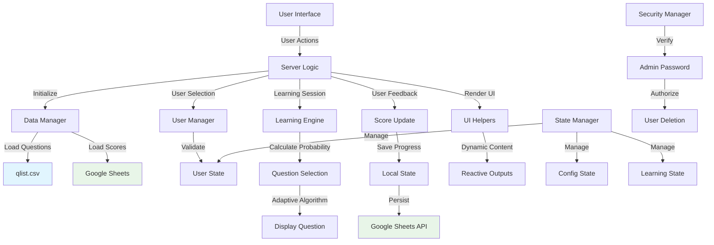

# ChugakuEigo - Japanese-English Learning App

## Overview

ChugakuEigo (中学英語) is a Shiny-based adaptive language learning application designed to help Japanese speakers practice translating Japanese sentences into English. The app uses an intelligent scoring system that prioritizes questions based on user performance, making learning more efficient by focusing on weaker areas.

## Features

### Core Learning Features
- **Adaptive Question Selection**: Questions are probabilistically selected based on user performance - lower scoring questions appear more frequently
- **Multi-User Support**: Individual user accounts with separate progress tracking and score history
- **Text Shuffling**: Randomizes elements within questions/answers to prevent rote memorization
- **Real-time Feedback**: Immediate OK/NG feedback system for self-assessment
- **Performance Analytics**: Detailed scoring and weak point analysis
- **Dynamic Question Management**: Safe insertion, deletion, and modification of questions without data corruption

### User Management
- **User Account System**: Create, switch between, and delete user accounts
- **Progress Persistence**: Automatic score saving with Google Sheets cloud backup
- **Administrator Controls**: Password-protected user deletion with security verification

### Customization Options
- **Question Range Control**: Adjustable question range selection
- **Difficulty Bias**: Configurable probability weighting for weakness-focused learning
- **Zero Score Inclusion**: Control how many zero-scored questions to include in selection

## Tech Stack

### Frontend
- **R Shiny**: Web application framework
- **HTML/CSS**: Custom styling and responsive design
- **DT (DataTables)**: Interactive question browsing tables

### Backend
- **R**: Core application logic and data processing
- **dplyr**: Data manipulation and transformation

### Data Storage
- **Local CSV**: Primary data storage with structured question database (`data/qlist.csv`)
  - Question data with unique IDs, timestamps, and content
  - ID-based architecture supporting safe insertion/deletion operations
- **Google Sheets API**: Cloud backup and multi-device synchronization
- **googlesheets4**: R package for Google Sheets integration

### Authentication & Security
- **Google Cloud Service Account**: Secure API authentication
- **bcrypt-style hashing**: Administrator password protection
- **JSON credentials**: Service account key management

### Development Tools
- **Modular Architecture**: Organized into specialized modules (data_manager.R, user_manager.R, etc.)
- **Namespaced Functions**: Consistent function naming conventions (data_*, user_*, learning_*)
- **Error Handling**: Standardized error response format across modules

## Data Flow



## Getting Started

### Prerequisites

Ensure you have R installed with the following packages:

```r
install.packages(c("shiny", "dplyr", "DT", "googlesheets4"))
```

### Installation

1. **Clone the Repository**
   ```bash
   git clone <repository-url>
   cd chugakueigo
   ```

2. **Set Up Google Sheets Authentication** (Optional - for cloud features)
   - Create a Google Cloud Project
   - Enable Google Sheets API and Google Drive API
   - Create a service account with editor permissions
   - Download the JSON key file to `credentials/service-account-key.json`
   - Share your target Google Sheets with the service account email

3. **Prepare Data Files**
   ```bash
   # Ensure the data directory exists
   mkdir -p data

   # Verify qlist.csv is present with question-answer pairs
   head data/qlist.csv
   ```

### Running the Application

#### Local Development
```r
# In R console or RStudio
shiny::runApp()

# Or specify port
shiny::runApp(port = 3838)
```

#### Production Deployment
The application is designed for deployment on platforms like shinyapps.io:

```r
# Deploy to shinyapps.io (requires rsconnect package)
library(rsconnect)
deployApp()
```

### Configuration

#### Basic Settings
- **Question Range**: Adjust via the settings tab slider
- **Probability Bias**: Configure learning difficulty focus (1.0 = unbiased, higher = more weakness-focused)
- **Zero Score Inclusion**: Control how many unscored questions to include

#### Advanced Configuration
Edit `constants.R` to modify:
- Default user settings
- Google Sheets configuration
- UI styling and behavior
- Learning algorithm parameters

### Usage

1. **Select User**: Choose your username from the dropdown (or create new via "manage" tab)
2. **Start Learning**: Click "Start Learning" to begin a session
3. **Practice**: View Japanese sentences and mentally translate to English
4. **Self-Assess**: Click "Show Answer" then rate yourself with "OK" or "NG"
5. **Save Progress**: Click "Save Score" when finished to persist your progress

### Data Structure

The app uses two main data sources:
- **Questions** (`data/qlist.csv`): Structured question database with:
  - `question_id`: Unique identifier for each question
  - `question`: Japanese sentence
  - `answer`: English translation
  - `created_at`: Question creation timestamp
  - `updated_at`: Last modification timestamp
- **Scores** (Google Sheets): User performance data with automatic cloud sync
  - ID-based score tracking linked to question IDs
  - Automatic padding for new questions
  - Resilient to question database modifications

Scores are tracked per question ID per user, enabling personalized adaptive learning paths with data integrity across question database changes.